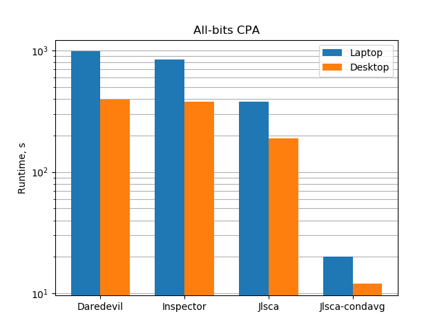
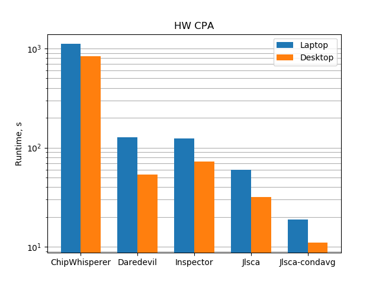

# DPA tools benchmarking

This is so far a very basic benchmarking of the computational part of differential power analysis implemented by existing tools. Only runtime to process a traceset is measured.

The motivation for performance benchmarking of DPA tooling is twofold:
1. Side channel analysis is an iterative experimental process where fast feedback loop from experiment to analyst is essential
2. In many settings the ultimate attack metric is not just the number of traces but the time required for key recovery

Slides with a bit more details (note that the figures there may be outdated compared to this repo):
* Short talk at the Summer school on real-world crypto and privacy, June 2017: [floss_dpa_tooling_sibenik.pdf](floss_dpa_tooling_sibenik.pdf)
* Talk at Cryptacus workshop, November 2017: [Open-source tooling for differential power analysis.pdf](https://cryptacus.cs.ru.nl/slides/Open-source%20tooling%20for%20differential%20power%20analysis.pdf)

To clone this repo with the included large datasets you will need [Git-LFS](https://git-lfs.github.com). Without Git-LFS, only pointers to large datasets will be cloned.

Maintainers: Cees-Bart Breunesse, Ilya Kizhvatov

## Tools and configuration

* Daredevil: https://github.com/SideChannelMarvels/Daredevil (GPLv3)
* ChipWhisperer: https://github.com/newaetech/chipwhisperer (GPLv3)
* Inspector: https://www.riscure.com/security-tools/inspector-sca (non-free, partially closed-source, serves as an industry standard reference point)
* Jlsca: https://github.com/Riscure/Jlsca (GPLv3)

Standard install described in the repositories/manuals of these tools.

For ChipWhisperer, the C-accelerated CPA implementation has to be built manually in `software/chipwhisperer/analyzer/attacks/cpa_algorithms/c_accel`.

As not all of the tools are scriptable, the benchmarking is only minimally automated.

## Test case 1: CPA on AES-128

Traceset: 100K traces, 512 float32 samples/trace, 32 byte data

### Running

Convert the traceset into different formats

    $ cd testcase01
    $ ./prepareTraceset.sh

Run measurements for main Jlsca variants and Daredevil. The timings are output at the end. You may want to adjust max memory and #threads settings for Daredevil in its config file. 

    $ ./run_jlsca_condavg[_hw].sh
    $ ./run_jlsca_inccpa[_hw].sh
    $ ./run_daredevil[_hw].sh

ChipWhisperer and Inspector are run from the GUI. Inspector configuration settings and ChipWhisperer attack script `attack_cpa_caccel.py` are included in the repository.

### Results all-bit CPA

| Tool                            | Laptop   | Desktop | Ratio |
|:------------------------------- |:-------- |:------- |:----- |
| Daredevil                       | 980      | 392     | 2.5   |
| Inspector                       | 847      | 377     | 2.3   |
| Jlsca, incremental correlation  | 381      | 189     | 2.0   |
| Jlsca, conditional averaging    | 20       | 12      | 1.6   |

ChipWhisperer does not include the all-bit CPA by default.

### Results classical CPA in the Hamming weight model

| Tool                            | Laptop   | Desktop | Ratio |
|:------------------------------- |:-------- |:------- |:----- |
| ChipWhisperer                   | 1109     | 840     | 1.3   |
| Daredevil                       | 128      | 54      | 2.4   |
| Inspector                       | 124      | 73      | 1.7   |
| Jlsca, incremental correlation  | 60       | 32      | 2.2   |
| Jlsca, conditional averaging    | 19       | 11      | 1.7   |

### Remarks

* Runtime shown in seconds
* Ratio column shows the speedup factor from moving to a more powerful platform
* Daredevil, Inspector and ChipWhisperer implement incremental correlation computation
* For ChipWhisperer, the two available non-accelerated versions took on a laptop 1 hour 14 minutes (Progressive) and 2 hours (Simple).
* Number of threads chosen for fastest execution:
    * for Daredevil, Jlsca and Inspector, number of physical cores x2 (assuming hyperthreading is on)
    * for Jlsca, for conditional averaging the number of threads does not matter
* Memory:
    * in Daredevil config, max memory is set to physical RAM size minus 1 GB
* Windows vs Linux:
    * Jlsca in Windows similar performance to Linux
    * Daredevil on Windows (cygwin build) 30% slower than on Linux

### Platforms

**Laptop**: i5-3230M 2.6 GHz (dual-core), 4 GB 1600 MHz DDR3, HDD, Ubuntu 16.04 x64 4.4.0-116 / Windows 7 x64

**Desktop**: i7-6700 3.4 GHz (quad-core), 64 GB 2133 MHz DDR4, HDD, Ubunutu 16.04 x64 4.4.0-116 / Windows 7 x64

TurboBoost is on, normal room temperature.

**Tool versions:**
* Daredevil `897f602`, built with g++ 5.4.0-6ubuntu1~16.04.5 and run under Linux
* Jlsca `6fa3f9bf`, run with julia 0.6.2 under Linux
* ChipWhisperer `5ba1b1c`, C-accel built with g++ 5.4.0-6ubuntu1~16.04.5, run with Python 2.7.12 under Linux. In later commits the C-accelerated attack segfaults.
* Inspector 4.12, run under Windows

Note that the same Jlsca code can run (with minimal additions) on a cluster of machines. This is not included here as it is quite a different setting, but described separately [in this tutorial](https://github.com/ikizhvatov/jlsca-tutorials/blob/master/HPC.md).
